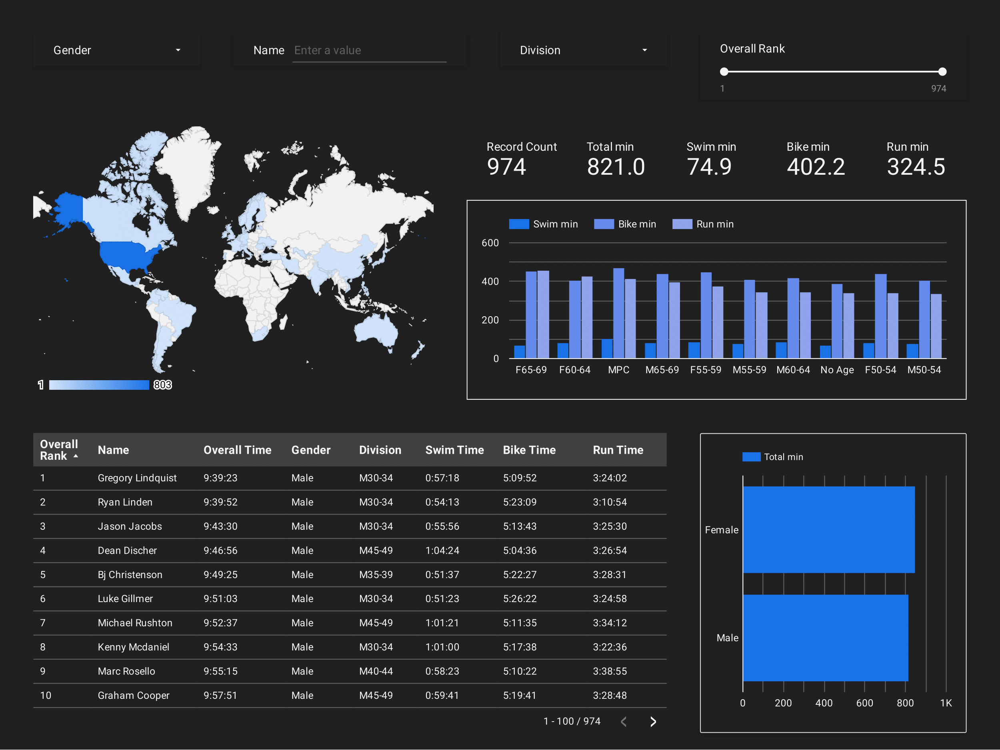

# Iron Man Tahoe Analysis

[Looker Dashboard Link](https://lookerstudio.google.com/reporting/abb17a96-dad1-4249-a342-a59dbf5d213b)

## Files
* **Ironman_analysis_sql.sql**: SQL analysis of data
* **ironman_vw.sql**: View used for Looker
* **ironman.ipynb**: Pandas charts/analysis
* **ironman_data_tahoe.csv**: Cleaned Excel data of event
* **requirements.txt**: Python packages used

## Questions answered in SQL analysis
1. Which country has the highest overall time and rank?
2. Average time by gender
3. Top 10
4. Country with most finishers
5. Average swim, bike, run times by division
6. Top perfomers in swim, bike, run
7. particpants per country
